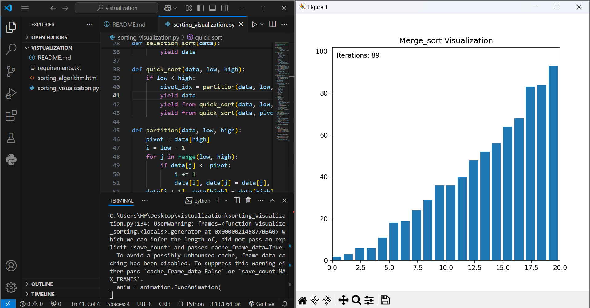
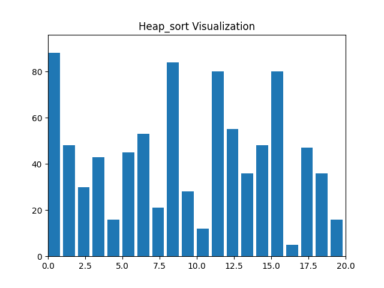

# Sorting Visualization

This project provides an animated visualization of six common sorting algorithms using Python and `matplotlib`. It also includes an accompanying HTML file to describe the algorithms and guide users through the selection process.

---

## Features

The project includes visualizations for the following sorting algorithms:

**Merge Sort**: A divide-and-conquer algorithm that divides the array into halves, sorts each half, and then merges them back together.
   

**Heap Sort**: A comparison-based algorithm that uses a binary heap data structure to repeatedly extract the maximum (or minimum) element and build the sorted array.
   

---

## How to Use

### Prerequisites

Ensure that Python is installed on your system. Additionally, install the required Python libraries:

```bash
pip install -r requirements.txt
```

### Running the Visualization

1. **Run the Python script**:
   ```bash
   python sorting_visualization.py
   ```

2. **Choose the sorting algorithm**:
   When prompted, enter the name of the sorting algorithm you want to visualize. The available options are:
   - `bubble_sort`
   - `insertion_sort`
   - `selection_sort`
   - `quick_sort`
   - `merge_sort`
   - `heap_sort`

3. **Watch the animation**:
   The program will display an animated bar chart showing the steps of the sorting algorithm.

### Using the HTML File

Open the `sorting_algorithms.html` file in a web browser to:
- Learn about the different sorting algorithms.
- Select an algorithm you want to visualize.

---


